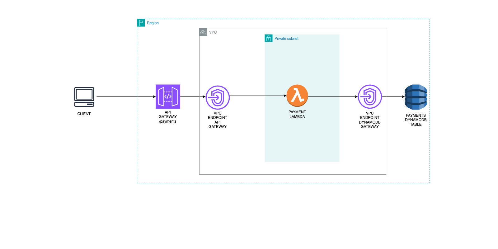

# DOCUMENTATION

This is the documentation for the application explaining the System Architecture, Security & Access Management of API and data, High Level Plan for Scalability and Availability and API Contract for our Recurring Payments Recorder API

## System Architecture
Below is the system architecture using various aws services like: AWS API Gateway, AWS Lambda and DynamoDB.

The above Diagram uses the API Gateway to get request from the client and then sends the event to the Lambda which is in a private subnet in our vpc for security reasons that will be explained better below. Then the Lambda sends the data to be stored to DynamoDB through the VPC DynamoDB gateway endpoint.

High Level: Our client makes a request to our API Gateway with the required header and body parameters then our API Gateway sends the event to our Lambda in a private subnet in a VPC through private AWS network with the help of the VPC endpoint and then our lambda does the compute and then stores the data sent in the DynamoDB table through AWS private network with the help of VPC endpoint again. My reason for going with this architecture is to ensure maximum security through the use of VPC and VPC endpoints for private network communication without having to go through the public internet as that causes more security concern. Also High Availability and scalability is essential with the communication of AWS services within the private network as that reduces Latency.

API Design:
The API was designed in a way the business logic or core functions is separated from the handler function. A design pattern known as Service Layer Design Pattern is what I used. This involves creating a different layer/folder that stores the business logic which is our `core` folder and is completely separate from the application's entry point which is our `handler`. This ensures separation of concern for all the components involved and helps with better code organization, testing and maintainability.

## Security & Access Management of API and data
The API and Data is secured extremely well through the following:

1. Virtual Private Cloud (VPC) Configuration:

Using VPC private and public subnets ensures certain services are not directly accessible on the internet and this reduces security risks and adds extra layer of security for our lambda and DynamoDB by making it isolated from the public internet and only available in our VPC.

2. Security Group for Lambda:

Adding security group to our lambda ensures we can control inbound and outbound traffic to our lambda. This is necessary for our Lambda to access DynamoDB securely over HTTPS.

3. VPC Endpoints:

DynamoDB VPC Endpoint: This ensures private and secure communication between the Lambda function and DynamoDB within the AWS network without having to expose any traffic or information to the public internet.

API Gateway VPC Endpoint: This also enables secure, private communication between the API Gateway and the Lambda function ensuring security when communicating or sending events from the API Gateway to the Lambda.

4. DynamoDB Configuration:

Encryption: AWS Managed Encryption has been enabled on our DynamoDB Table and this ensures that the data stored is encrypted at rest providing an additional layer of data security.

IAM Permissions: The Lambda function has been granted only the specific permissions required to write data to the DynamoDB Table. This ensures that only the Lambda function can perform write operations on the table.

5. API Gateway Configuration:

API Key: The API Gateway requires an API key to access the POST method on the `/payments` resource. This restricts access to authorized clients only.

Usage Plan: Associates the API key with a usage plan to control and monitor API usage, preventing misuse and managing access rates.

6. Lambda Function Configuration:

VPC Placement: The Lambda function is deployed in a private subnet with egress, ensuring it is not directly accessible from the internet. This adds an extra layer of security.

Security Group: The Lambda function uses a security group that restricts outbound traffic, ensuring it can only communicate with necessary services like DynamoDB.

## High Level Plan for Scalability and Availability
There are various things we can do to ensure scalability and high availability of our system.

1. API Gateway: To ensure High Availability we could deploy our API Gateway to multiple regions for better performance and availability. We can also use Load balancers and Auto Scaling groups for very high traffic.

2. AWS Lambda Function Scaling: By Default AWS Lambda automatically scales horizontally with the number of incoming requests so this already helps with scalability. We can also increase the reserved concurrency limit of our lambda to handle unexpected spikes in traffic. Also we can consider enabling provisioned concurrency for our Lambda function if we know the expected consistent Load we expect.  so we can reduce cold start times and ensure high availability.

3. VPC and Networking: We can ensure to have multiple Availability Zones for High Availability in case there is an issue in one of the Availability Zones. Also using VPC endpoints for our DynamoDB and API Gateway reduces latency by ensuring traffic and communication is within the AWS network and not the public internet.

4. DynamoDB: DynamoDB has on-demand capacity mode that automatically adjusts to accommodate traffic without manual intervention. This is really helpful for scaling during unexpected traffic spikes. 

5. Monitoring and Logging: We can set up CloudWatch Alarms for monitoring Lambda function errors, duration and concurrency limits to know when things go wrong. We can also use it to monitor DynamoDB throttling. Also we can use AWS XRAY for end-to-end tracing of requests as they move through the API Gateway, Lambda and DynamoDB to help identify any bottlenecks.

## API CONTRACT
The API Contract of this application can be found [here](documentation/api-contract/openapi.yaml)
You can copy and past the yaml file in the [swagger.io editor](https://editor.swagger.io/) to see a nice representation of the API Documentation.